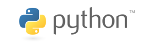

# SDV - L1 - Introduction à la bioinformatique

## Programmation Python

### JupyterLite

JupyterLite nécessite un navigateur web moderne :

- Firefox 90+
- Chromium 89+

## Licence

Ce contenu est mis à disposition selon les termes de la licence [Creative Commons Attribution - Partage dans les Mêmes Conditions 4.0 International](https://creativecommons.org/licenses/by-sa/4.0/deed.fr) (CC BY-SA 4.0). Consultez le fichier [LICENSE.txt](LICENSE.txt) pour plus de détails.
